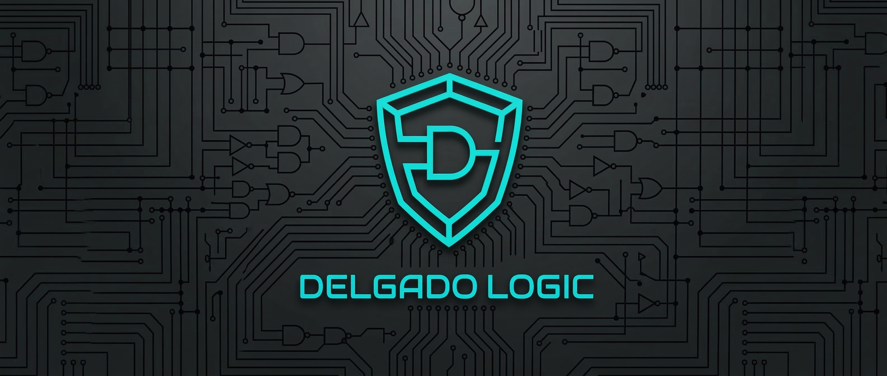

# DelgadoLogic — AR-Series Infrastructure

<p align="center">
  
</p>

<p align="center">
  <strong>Enterprise-Grade Windows 11 Audio Recovery</strong><br>
  <em>Architect v5.5 — GUI HUD Telemetry · Registry Power-State Sanitization · ITIL-Aligned Service Tiers</em>
</p>

<p align="center">
  <a href="https://delgadologic.tech">🌐 Website</a> ·
  <a href="mailto:support@delgadologic.tech">📧 Support</a> ·
  <a href="https://github.com/Chronolapse411">👤 GitHub</a>
</p>

---

## 🔧 The Problem

Windows 11 "Moment 5" update (KB5035853) introduced a kernel-level audio subsystem regression affecting Realtek, Intel Smart Sound, and Senary-based drivers. Symptoms include complete audio loss, phantom devices in Device Manager, and `ConservationIdleTime` registry corruption in the `{4d36e96c}` class key.

## ⚡ The Solution: AR-Series Architect v5.5

A fully automated, 7-phase repair pipeline with real-time GUI HUD telemetry — built for IT professionals and advanced Windows administrators.

### Architecture Highlights

| Component | Technology | Purpose |
|---|---|---|
| **GUI HUD** | WinForms + System32 driver enumeration | Visual telemetry during DISM/SFC deep repair |
| **Registry Engine** | PowerShell 5.1 + HKLM Class Keys | `ConservationIdleTime` binary override (`0x1E` → `0x00`) |
| **PnP Auditor** | `pnputil /enum-drivers` | OEM driver corruption detection (Realtek, Senary, SST) |
| **Telemetry Export** | JSON (`ConvertTo-Json`) | Diagnostic ID, timestamp, billing metadata |
| **Safety Gate** | `Checkpoint-Computer` | Auto-restore point before any system modifications |
| **MotW Remediation** | `Unblock-File` in `.bat` launcher | Silently clears "Mark of the Web" security blocks |
| **UAC Self-Elevation** | VBScript `ShellExecute` + `cacls` | Zero-friction admin escalation |

### The 7-Phase Repair Cycle

```
Phase 1 → Kernel Integrity HUD (DISM + SFC visual scan)
Phase 2 → System Restore Point creation
Phase 3 → Driver Store PnP audit via pnputil
Phase 4 → Registry Power-State overrides (ConservationIdleTime)
Phase 5 → Hardware bus re-enumeration (Restart-PnpDevice)
Phase 6 → Audio engine service restart (Audiosrv + AudioEndpointBuilder)
Phase 7 → Verification tone playback + JSON telemetry export
```

## 🏗️ Service Tiers (ITIL-Aligned)

| Tier | Package | Delivery | Contents |
|---|---|---|---|
| **Lite Triage** | `AR_v5.5_Lite_Triage.zip` | Free | Launcher + diagnostic scanner + manifest |
| **Enterprise Suite** | `AR_v5.5_Enterprise_Suite.zip` | $4.99 (PayPal) | Full 7-phase engine + Pro Manual + branding |

## 📁 Repository Structure

```
DelgadoLogic-Infrastructure/
├── public/                          # Firebase Hosting (delgadologic.tech)
│   ├── index.html                   # Landing page + PayPal integration
│   ├── favicon.jpg                  # Logic Shield favicon
│   ├── profile.jpg                  # Engineer profile
│   └── assets/
│       ├── branding/                # AppIcon, Banner, Favicon
│       └── downloads/               # Distribution ZIPs
├── product/AR_AudioRestore/         # Core product (gitignored)
│   ├── Core_AR_v5.5.ps1             # Full 7-phase repair engine
│   ├── Lite_AR_v5.5.ps1             # Free diagnostic scanner
│   ├── Launch_AR_Enterprise.bat     # One-click Pro launcher
│   ├── Launch_AR_Lite.bat           # One-click Lite launcher
│   ├── Manual_AR_v5.5.pdf           # Pro Recovery Guide
│   ├── 0_START_HERE_ENTERPRISE.txt  # Paid manifest
│   ├── 0_START_HERE_LITE.txt        # Free manifest
│   └── Resources/                   # Branding assets
├── functions/                       # Cloud Functions v2 (Node 20)
│   └── index.js                     # PayPal webhook handler
├── documentation/                   # Business & technical docs
│   ├── fulfillment_email_template.md
│   ├── setup_guide.md
│   ├── customer_success_plan.md
│   └── roadmap_to_revenue.md
├── firebase.json                    # 4-subdomain hosting config
└── README.md                        # This file
```

## 🌐 Infrastructure

| Service | Domain | Platform |
|---|---|---|
| **Portfolio** | `delgadologic.tech` | Firebase Hosting |
| **API** | `api.delgadologic.tech` | Cloud Functions v2 |
| **Docs** | `docs.delgadologic.tech` | Firebase Hosting |
| **Audit** | `audit.delgadologic.tech` | Firebase Hosting |

**Payment:** PayPal REST API with webhook verification  
**Secrets:** Google Secret Manager (`paypal-client-id`, `paypal-secret`)  
**Billing Statement:** `DELGADOLOGI`

## 🛡️ Security

- Product assets excluded from Git via `.gitignore`
- Git history scrubbed with `--force` push to eliminate leaked assets
- Paid downloads delivered via Firebase Storage Signed URLs (24-hour expiry)
- `.bat` launchers include `Unblock-File` to remediate MotW blocks
- Legal disclaimer with `YES` consent gate before any system modification

## 👨‍💻 Author

**Manuel Alejandro Delgado**  
Lead Systems Engineer · Washington, D.C.  
Delgado Creative Enterprises LLC

- 🌐 [delgadologic.tech](https://delgadologic.tech)
- 📧 [support@delgadologic.tech](mailto:support@delgadologic.tech)
- 💻 [github.com/Chronolapse411](https://github.com/Chronolapse411)

---

<p align="center">
  <em>DISCLAIMER: This utility is for IT professionals and advanced users. DelgadoLogic is not responsible for data loss or hardware failure. Always back up your registry and data before making changes.</em>
</p>

<p align="center">© 2026 Delgado Creative Enterprises LLC · MIT License</p>
