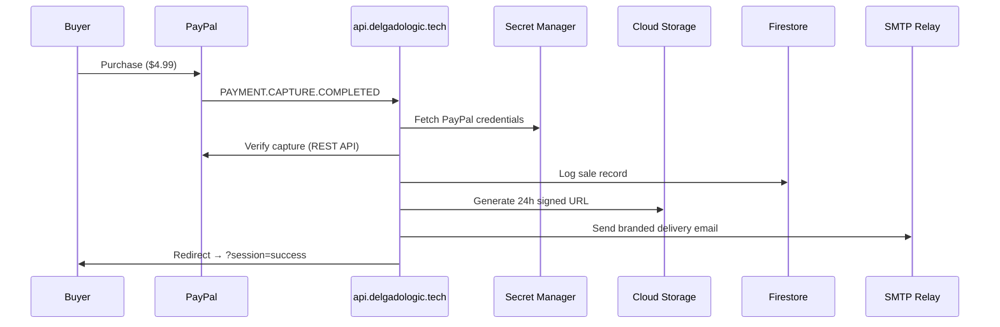

<div align="center">

# 🔧 DelgadoLogic — Automated IT Recovery Infrastructure

**Professional-grade automated fulfillment pipeline for digital IT support products.**

[](https://firebase.google.com)
[](https://nodejs.org)
[](https://developer.paypal.com)
[](https://cloud.google.com/functions)

[Live Site](https://delgadologic.tech) · [API Endpoint](https://api.delgadologic.tech) · [Documentation](https://docs.delgadologic.tech)

</div>

---

## Overview

**DelgadoLogic** is a production-grade, multi-subdomain platform that automates the sale and delivery of IT diagnostic tools. The flagship product — the **Windows 11 AudioRestore Pro Guide** — is delivered through a zero-touch pipeline: payment verification, signed-URL generation, and branded email delivery happen within seconds of purchase.

## Architecture

```
delgadologic.tech                → Portfolio & Product Landing Page
├── api.delgadologic.tech        → PayPal Webhook Fulfillment Engine
├── docs.delgadologic.tech       → Technical Documentation Portal
└── audit.delgadologic.tech      → Security Auditor / Staging
```

### System Flow



## Tech Stack

| Layer | Technology | Purpose |
|---|---|---|
| **Hosting** | Firebase Hosting (Multi-Site) | 4-subdomain architecture with SEO headers |
| **Compute** | Cloud Functions v2 (Node 20) | PayPal webhook handler + daily health check |
| **Storage** | Cloud Storage (Private Bucket) | Secure product file hosting with signed URLs |
| **Database** | Cloud Firestore | Transaction logging and health monitoring |
| **Auth** | Firebase Auth (Anonymous) | Secure session management |
| **Secrets** | Google Secret Manager | Encrypted PayPal API credentials |
| **Payments** | PayPal REST API (v2) | Hosted button + webhook capture verification |
| **Email** | Nodemailer (Gmail SMTP) | Branded HTML fulfillment emails |

## Key Features

- **Automated Fulfillment** — Zero-touch delivery: payment → verification → signed URL → email, all within seconds
- **Multi-Subdomain SOA** — Clean service-oriented architecture across 4 branded subdomains
- **24-Hour Signed URLs** — Time-limited download links generated per transaction for security
- **PayPal Webhook Verification** — Server-side capture verification against the PayPal REST API
- **Daily Health Checks** — Scheduled Cloud Function pings PayPal API and logs status to Firestore
- **High-Conversion Email** — Dark-mode branded HTML with 3-step PowerShell Quick Start guide
- **SEO Headers** — X-Frame-Options, X-Content-Type-Options, Referrer-Policy, Permissions-Policy

## Project Structure

```
Manuel-Portfolio-2026/
├── public/                    # Main portfolio site
│   ├── index.html             # Landing page with PayPal integration
│   └── profile.jpg            # Professional headshot
├── api-public/                # API subdomain root
├── docs-public/               # Documentation subdomain root
├── audit-public/              # Security auditor subdomain root
├── functions/
│   ├── index.js               # Cloud Functions (webhook + health check)
│   └── package.json           # Node 20 runtime dependencies
├── product/                   # Secure product assets
│   ├── Win11_AudioRestore_Pro_Guide_DelgadoLogic.pdf
│   └── fix_audio_moment5.ps1
├── documentation/
│   ├── fulfillment_email_template.md
│   ├── customer_success_plan.md
│   ├── roadmap_to_revenue.md
│   └── setup_guide.md
├── firebase.json              # Multi-site hosting + functions config
├── firestore.rules            # Strict deny-all security rules
└── .firebaserc                # Hosting targets & project alias
```

## Deployment

```bash
# Deploy all hosting sites
firebase deploy --only hosting --project manuel-portfolio-2026

# Deploy Cloud Functions
firebase deploy --only functions --project manuel-portfolio-2026
```

## Security

- All product files stored in a **private Cloud Storage bucket** — no public access
- PayPal credentials stored in **Google Secret Manager** — never hardcoded
- Firestore rules enforce **deny-all** for client SDK — admin SDK bypasses via Cloud Functions
- Hosting delivers **security headers** on all responses (DENY framing, nosniff, strict referrer)
- Download URLs are **time-limited signed URLs** (24-hour expiry per transaction)

---

<div align="center">

**Built by Manuel Alejandro Delgado**
Lead Systems Engineer · [DelgadoLogic.tech](https://delgadologic.tech)

</div>
